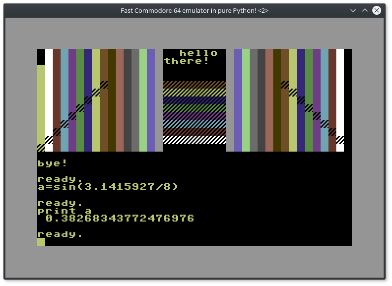
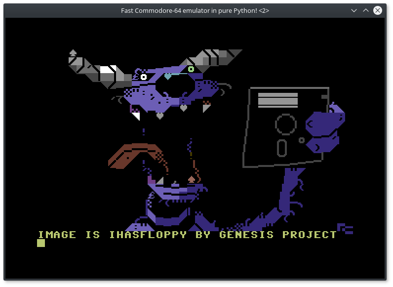
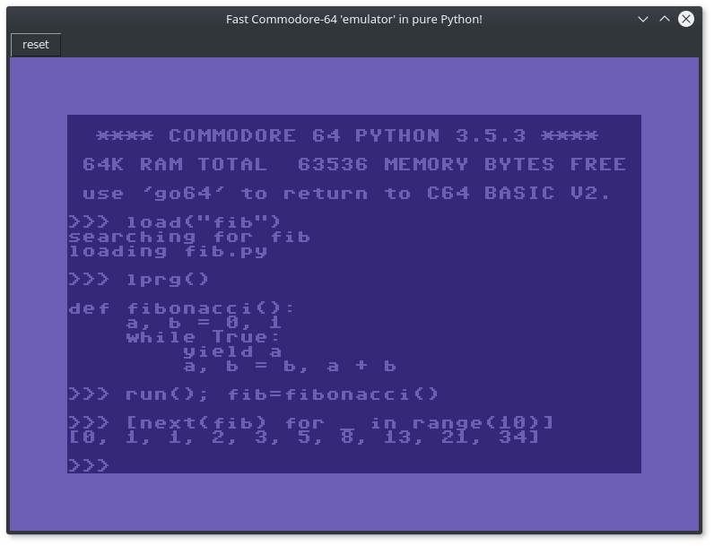
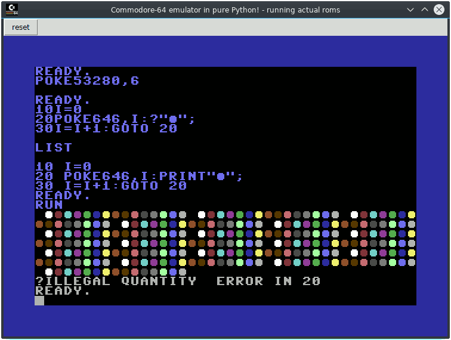

# pyc64: Commodore-64 simulator in pure Python!

... Or is it?

Well, it emulates the character mode *with sprites* quite well and thus you can display pretty PETSCII pictures if you want.
It's generally not possible to run actual C-64 software, but that's not the real goal
of this project. (Look at actual c-64 emulators such as Vice or CCS64 if you want that)

## 6502 machine code execution

Yes, this thing can actually run 6502 machine code and
has a built-in machine code monitor.
This is made possible by the awesome [py65](https://github.com/mnaberez/py65) library. 
Note that while it can run the 6502 code,
you can only do the same things with it as what is supported
for the BASIC mode. So no fancy screen scrolling or rasterbars...

## Can run the real BASIC and KERNAL roms! True C64 emulation! 

If basic/kernal/chargen ROM files are supplied in the roms folder,
the simulator will load these and make them part of the memory of the machine as ROM areas.
If you run the ``startreal64`` program, it will load the ``realemulator`` module
instead of the simulated one, and will *actually run the C64 BASIC ROM*. 

You can type anything in BASIC that you could type on a real C64 too!

Unfortunately, the I/O is not emulated so it is not possible to load or save
your programs in this mode.

On my machine the current code runs at around 0.6 Mhz in regular Python 
(around half the speed of a real c64),
and between 2 and 3 Mhz in Pypy (there is a lot more speed than this obtainable
with pypy, but that makes the c64's basic mode more or less unusable)

### I/O Emulation
In real mode, you can load real programs using I/O emulation.
Also you can specify load file at boot: for example, for loading drive8/hello.prg at boot type

> python3 startreal64.py hello

Try also:

> python3 startreal64.py gary2

TAPE are redirected to drive8

## BASIC V2 and the VIC-registers (video chip)

A subset and variant of the BASIC V2 in the C-64 is provided.

Some VIC-II registers have been made available:

- 53280 and 53281 screen and border colors ($d020/$d021)
- 646 cursor color ($0286)
- 1024-2023 the screen buffer characters ($0400-$07e7) 
- 55296-56295 the screen buffer colors ($d800-$dbe7)
- 53272 charset shift/unshift register ($d018)
- 53265 and 53270 horizontal and vertical smooth scroll registers ($d011/$d016)
- 56320 joystick port 2 bits
- the [sprite](https://www.c64-wiki.com/wiki/Sprite) registers! (no multicolor though, and no priority register and collision detection)

## Keyboard

A few function keys are remapped as wel for convenience, like the fastloader cartridges of old:

- F1 = LIST:
- F3 = RUN:
- F5 = LOAD shortcut
- F6 (shift-F5): LOAD "*",8  shortcut
- F7 = DOS"$ to show directory of drive8

Other uncommon keys:
- Esc = RUN/STOP
- Ctrl = Commodore key
- PgUp = RESTORE key
- Insert/Help = INSERT
- End = move to end of current logical line
- the reset button on top = perform warm reset
- numpad keys = joystick (r_ctrl or 0 or enter = fire)

Note that most of the BASIC operations are essentially handled by Python itself via eval(),
so you can do many interesting things that are silly to see working on a classic 80's c-64 screen.
For instance, try ``print 5**123``  or ``print sys.platform`` or ``print sum(log(x) for x in range(1,10))``

It is not yet supported to do any blocking operation such as INPUT or WAIT.
However, GET *is* supported (which gets one keypress from the keyboard buffer)
So simple interactive programs can be created.

## 1541 disk drive

Rudimentary read-only support for a simulated disk drive is available.
Some demo programs are included 'on the disk' (=the 'drive8' directory),
including some that draw some pretty PETSCII images as seen in the
screenshot.

## Python REPL in your C64

Enter the 'gopy' command to switch to a Python REPL, and use 'go64' to switch back to BASIC.
Some convenience symbols are provided in the REPL to access the screen
and memory for instance. Try 'dir()' to see what's there.

## dependencies

You'll need the [pillow](https://pillow.readthedocs.io) library because 
the program needs to do some charset bitmap conversions at startup for tkinter.

You'll also need the [cbmcodecs](https://github.com/dj51d/cbmcodecs) library to handle
translation of ASCII text to and from the C-64's PETSCII and screencode values.
An updated version 0.2.1 that works with Python 3.9 [is here](https://github.com/irmen/cbmcodecs) but
that one is not yet available on Pypi... (hence the github link in requirements.txt)

If you want to execute 6502 machine code or inspect the memory via a
machine code monitor, you also need the [py65](https://github.com/mnaberez/py65) library. 
()This allows you to actually run a few simple "real" C64 programs! Some of them 
are included on the 'virtual disk' in this project)

## screenshots

PETSCII image:

Python mode:

Real emulation of a C64:

